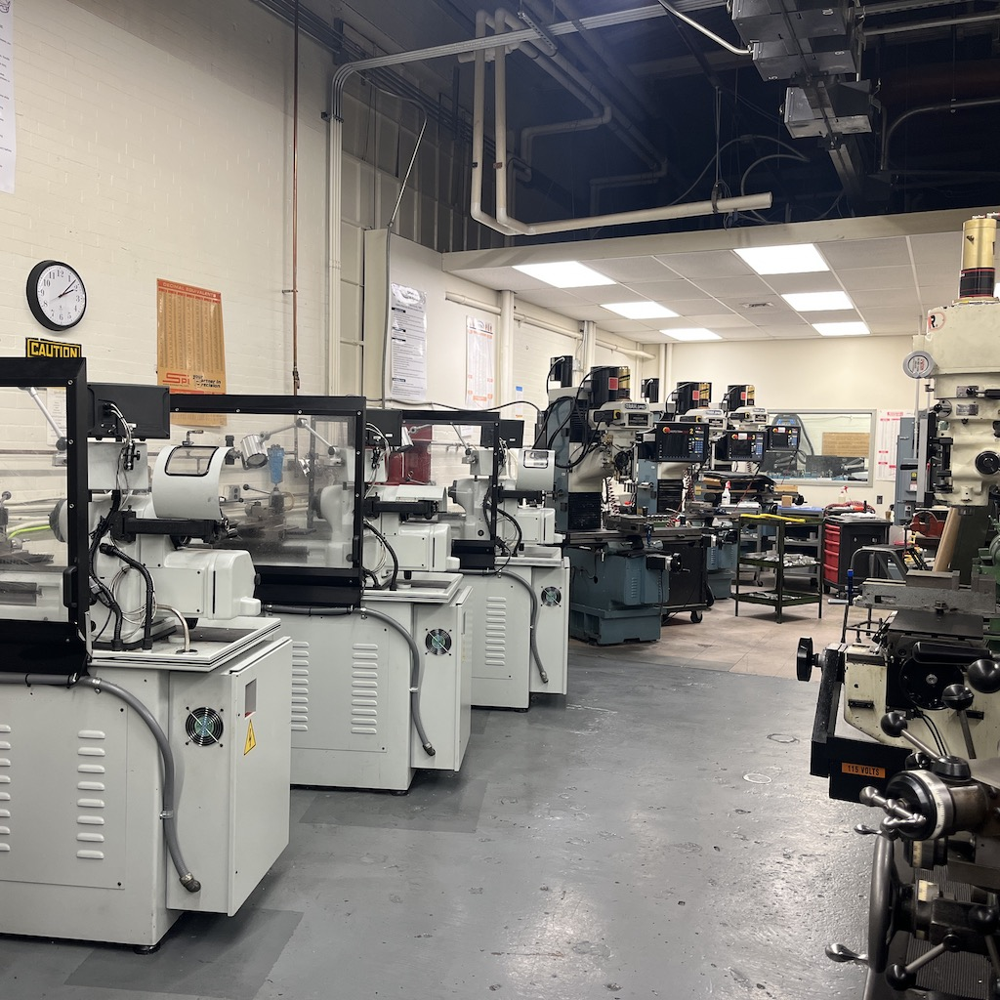
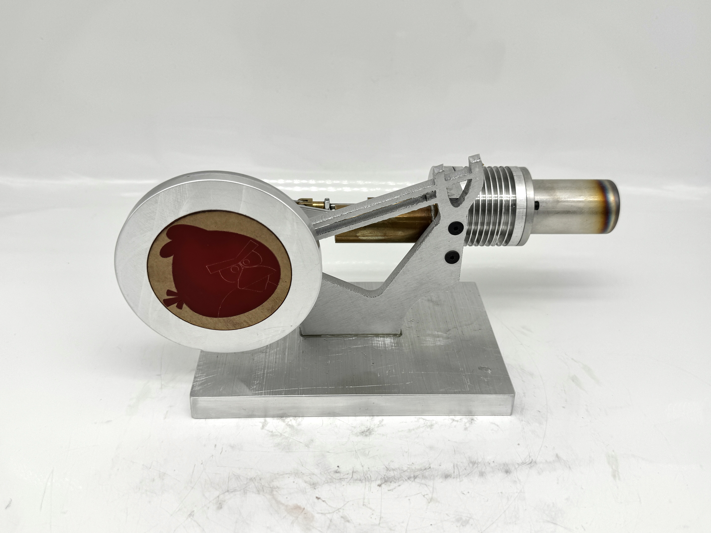
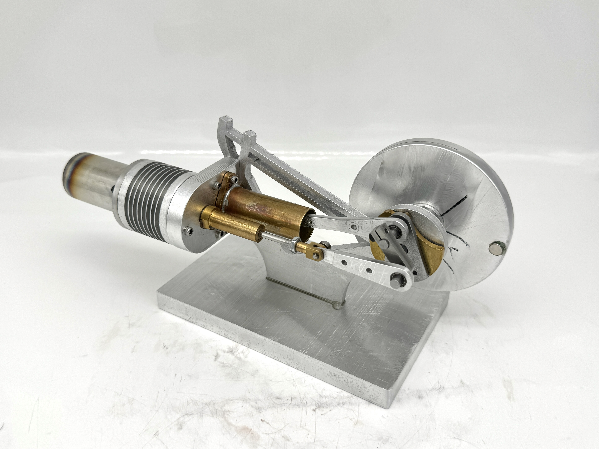

## Project Overview
For my MEAM 2010 course I decided to make an Angry Birds inspired Stirling Heat Engine using CNC milling, MasterCAM, Conversational Programming, and Lathes.

### Design

A full SolidWorks assembly was made for the stirling engine with accurate motion. 

### Manufacturing and Assembly

Components were manufacutred via manual milling, lathes, and CNC machining in the Percision Machining Lab at the University of Pennsylvania.

The bedplate was manufactured via send-cut-send.

### Final Engine 

