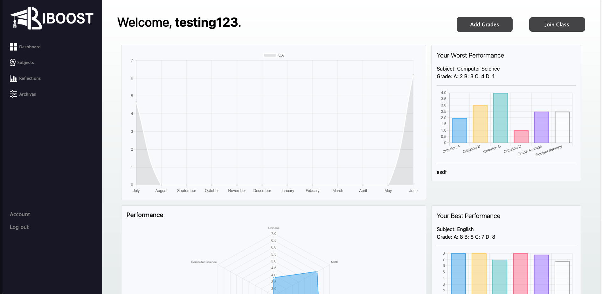

## Project Overview

During the COVID-19 outbreak, the extended lockdown in Hong Kong made it much more difficult for students to focus on their coursework, and for teachers to adequately support students. This made the assessment heavy cirriculumn even harder to follow. Together with two of my friends, we decided to develop a web app that could help students keep track of their assignments, grades, and better connect them with teachers. The app also integrated the newly school mandated student reflection record.

### IBoost Dashboard Page

We used Django to create the webapp and we were able to track grades and assignments using a centralized database, and were then able to provide suggestions and recommend clips from a large database of pre-recorded interviews with teachers. We also made a teacher-side interface that would allow them to track and assign suggestions to students.

### Reflection Record

