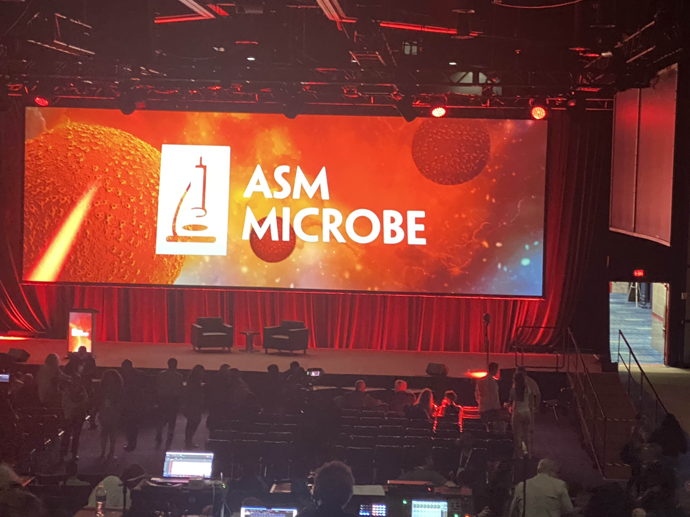
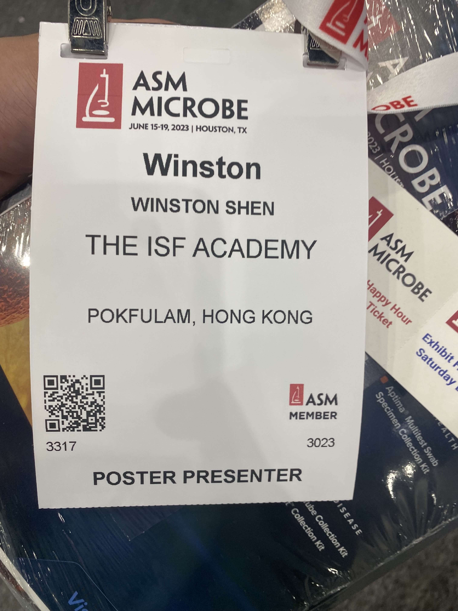

## Project Overview

Throughout high school I conducted research into bioremediating bacteria and its applications. The bacteria was isolated from sediment samples collected in a local typhoon shelter.  Initially I was trying to produce a heatmap to identify areas of high heavy metal pollution in the Aberdeen Typhoon Shelter. Through collecting samples from 60+ unique locations, I was able to create a comprehensive heat map detailing concentrations of toxic heavy metals such as lead, arsenic, and mercury. From the heat map, I drew the conclusion that antifouling marine paint was a main source of the heavy metal pollution, and prompted the government to implement no fishing signs in the area. 

During sample collection, I noticed a lighter colored layer of film on top of the sediment samples. With help from my teachers and mentors, we hypothesized that this hypoxic layer could mean that strains of heavy metal resistant bacteria were growing in the sediment. We set out to isolate these strains and study them for potential bioremediation applications.

# Annotations, SEM, and Conference

In the school microbiology lab, specific strains of bacteria were isolated from the sediment based on their resistance to heavy metals, toluene, and malachite green. Using 3 different strands of bactiera, I made a bioreactor that could create soluble lead sulfide particulates from lead ions in solution, and tested the performance of each strand. DNA of these bacteria strands were then extracted and sequenced and assembled using Unicycler hybrid assembly. After annotating the sequence, We were then able to hypothesize a potential pathway that the bacteria uses to create soluble metal sulfides, and collected evidence to verify this pathway using a Scanning Electron Microscope fitted with Energy-dispersive X-ray spectroscopy to determine the elmental composition of the metal precipitate collected from the bacteria samples.

I went to AGU, IEEE, and ASM conferences with my research over the years, and won the best research/poster award at the IEEE youth conference. 

### ASM Microbe Houston Texas

### ASM Poster

### My Badge

