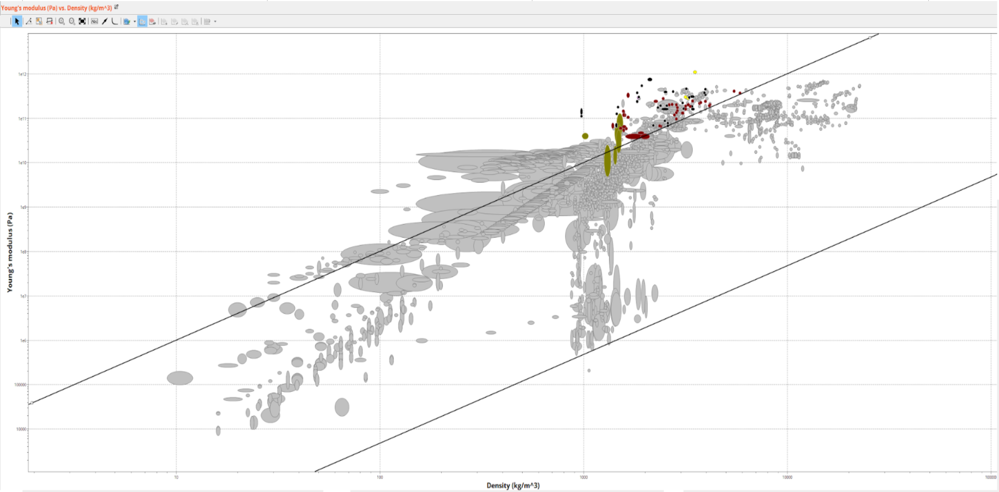
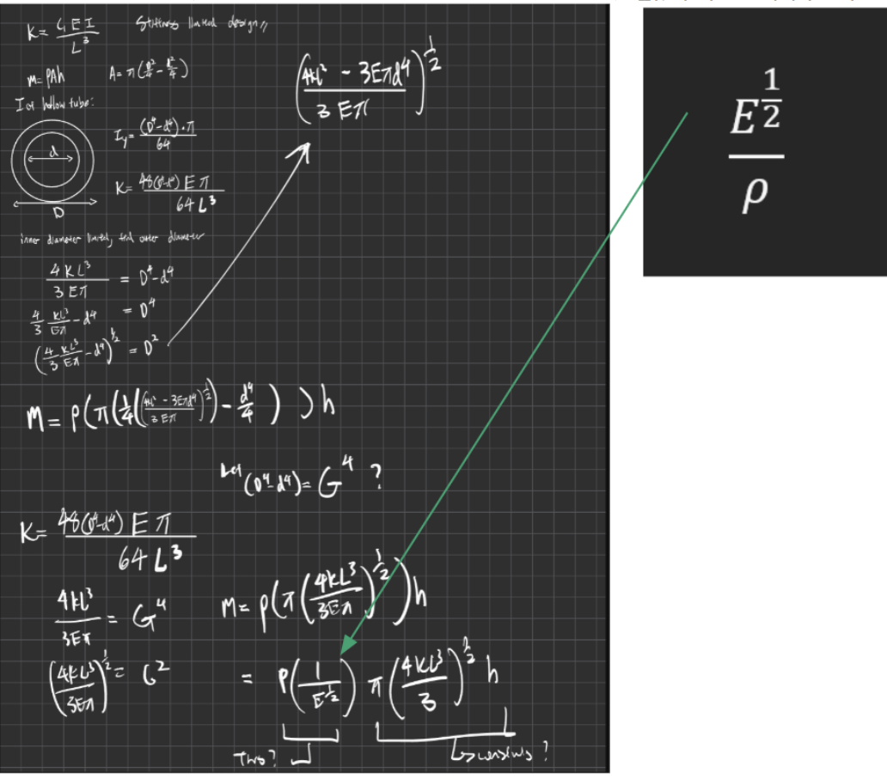
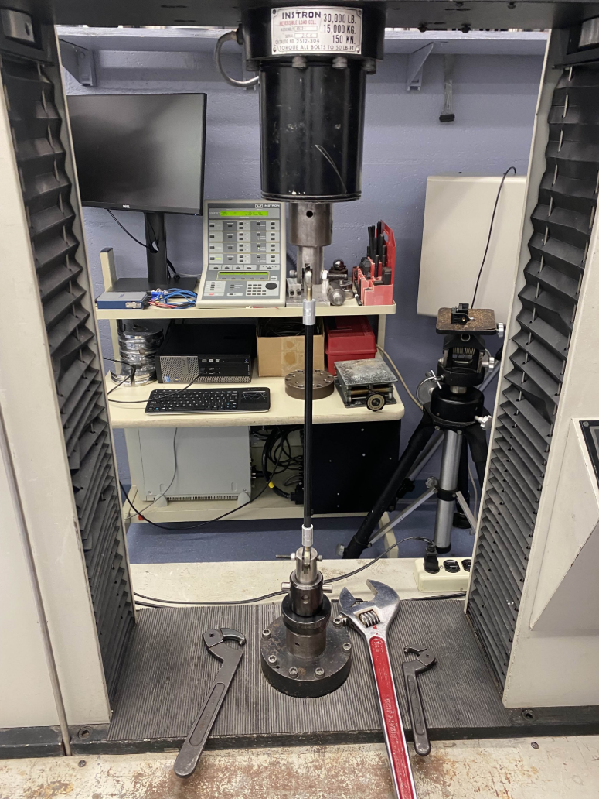
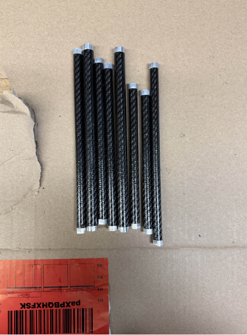
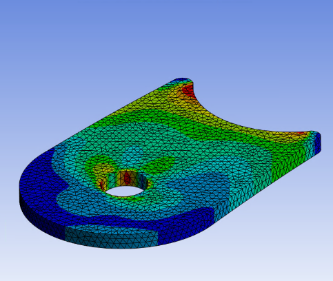
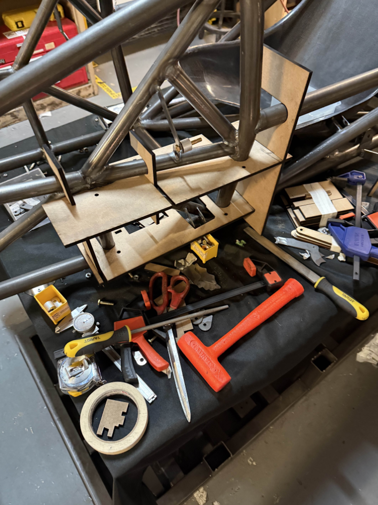

## Project Overview

I worked in a team of 3 to develop the first carbon fiber control arms in team history.  I derived material indices specific to our control arm use case and used Ashby Charts to select materials based on strength and stiffness. I researched into different weave types and landed on a unidirectional weave that would improve strength in compression (which is limited by the tube itself). 

### Ashby Chart

### Material Index Calculation

Based on real time load solver data I was able to size tubes using the data sheet data.  I also back calculated an optimized tube with an appropriate safety factor, however, this tube size was not available so the closest match was used instead.  The tubes were up to 7.6 times lighter than the old steel tubes.

Using Solidworks and Ansys FEA, I helped design prototypes of the new inserts and bearing housing for CFRP tubes with DFM in mind.

To validate our desgins and calculations we tested our control arms in tension and buckling using an Instron machine, and plotted stress-strain, force-displacement curves to improve upon our previous model.

### Instron Testing

## Pull/Tie Rods and Tabs

Armed with more knoweledge and experience, we were able to improve the previously used bonding process for carbon fiber linkages, and applied this to the manufacturing of the pull and tie rods for the 24-25 vehicle.

### Manufactured Pull and Tie Rods

I also used FEA to validate tab design, and created welding jigs to accuratley position and weld the control arm tabs.

### Tab FEA

### Welding Jig

