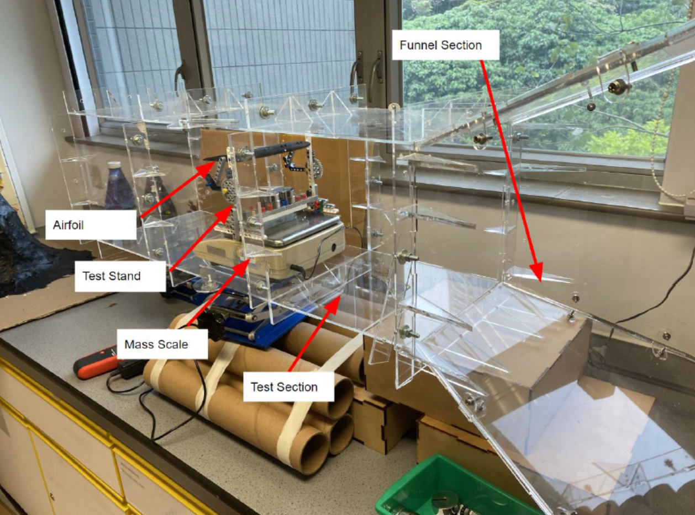
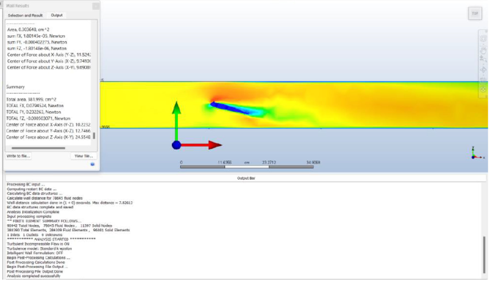

## Project Overview

For my IB extended essay I decided to explore my passion for engineering and aeronautics though investigating the effects of vortex generators on the lift profile of a 737 wing.

I assembled a wind tunnel using laser cut acrylic pannels, and flow regulators made from cardboard tubes.

### Wind Tunnel Setup

I designed and 3D printed several custom airfoils with different vortex generator configurations and tested them in the tunnel, and
compared the results against a CFD simulation I set up using AutoDesk CFD.

### Lift Profile for 3 VG Configuration

### AutoDesk CFD Simulation
