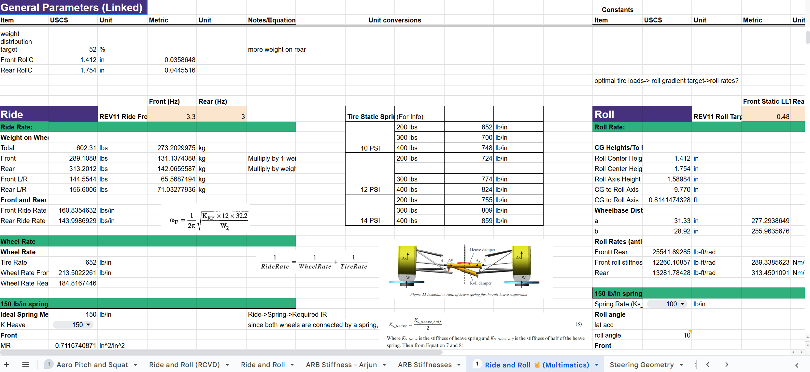

## Project Overview
I am leading a team of students in the designing, manufacturing, and testing of the suspension and steering systems for the 25-26 FSAE vehicle.

I played a large role in research and project management before commencement of the 25-26 season. I conducted research into a decoupled suspension system and revamped our calculations for the change if need be.

### Revamped calculations and considerations for decoupled suspension

I designed the dynamic parametric Suspension CAD Assembly and optimized suspension geometry using the Lotus Kinematics Solver

