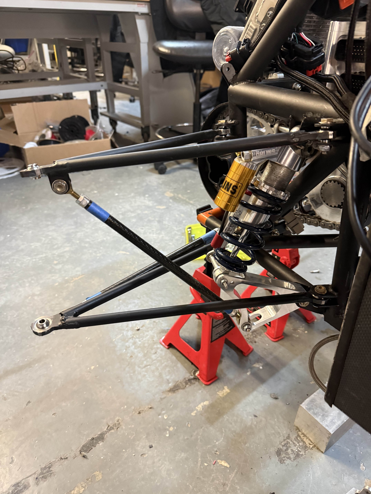
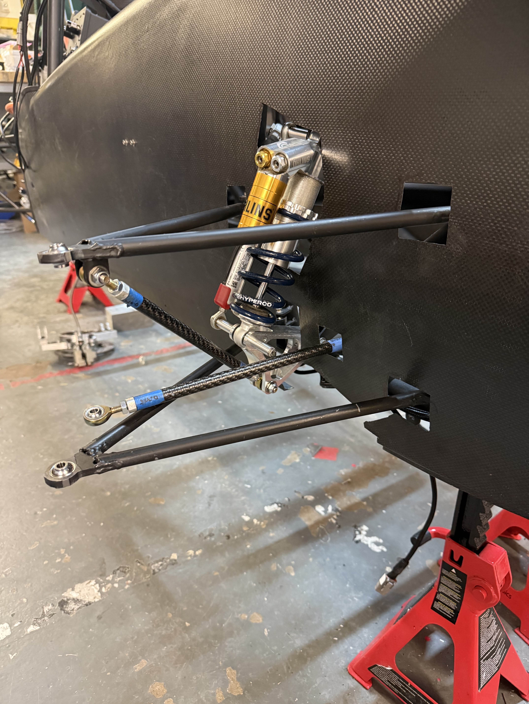
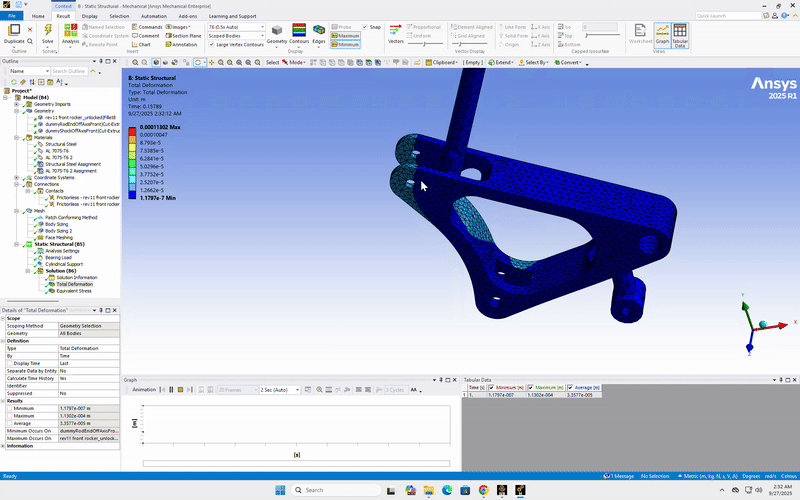
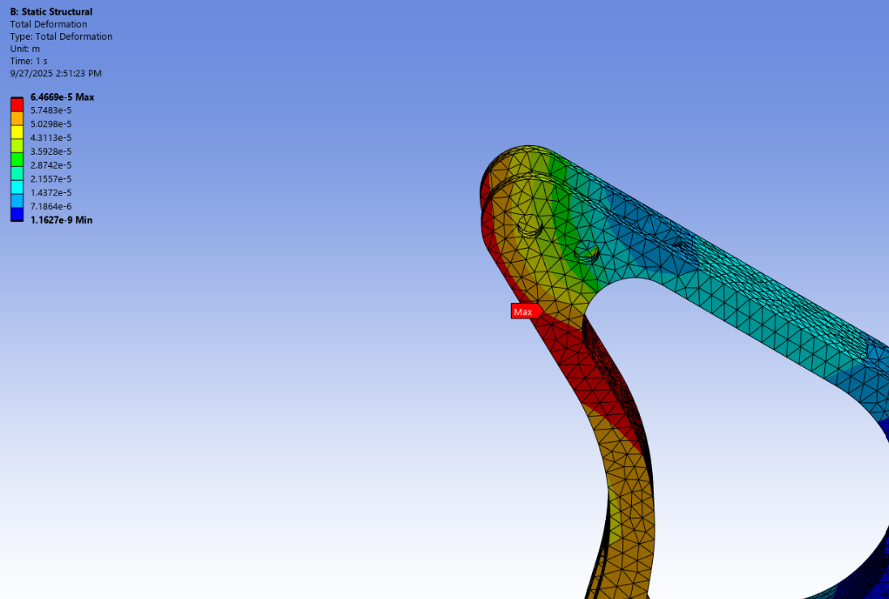
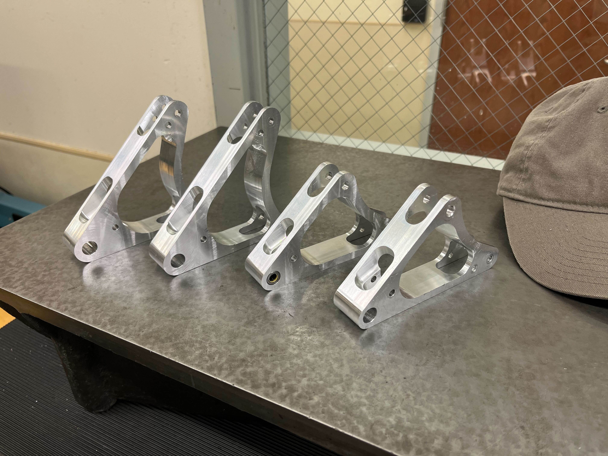
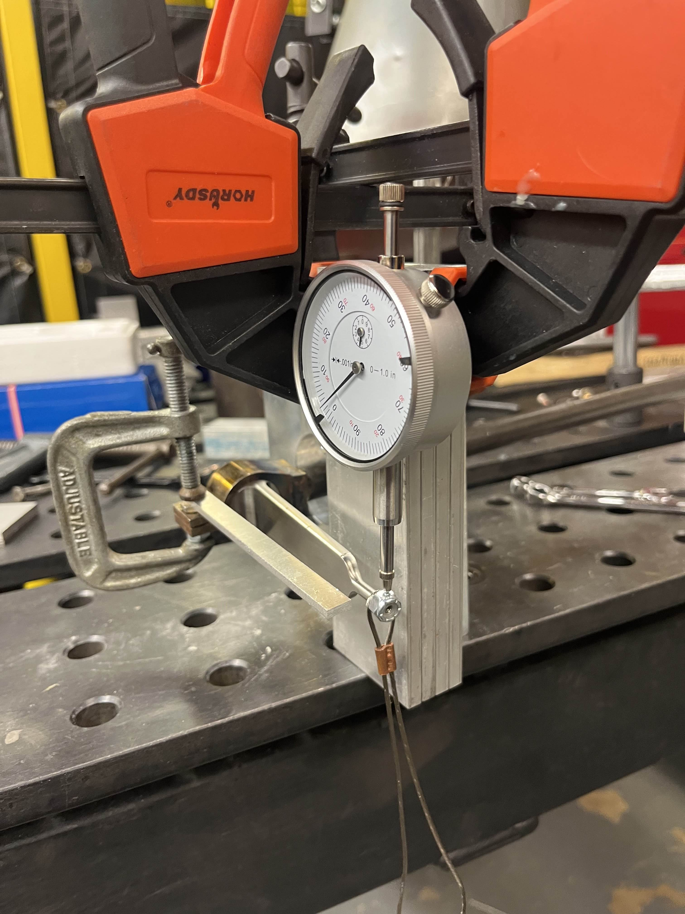
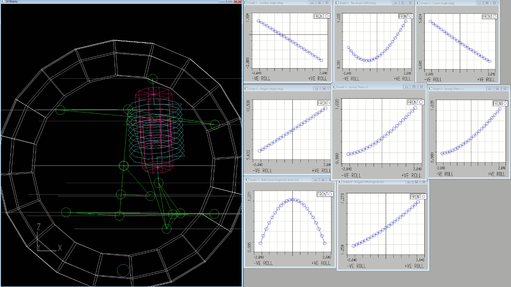
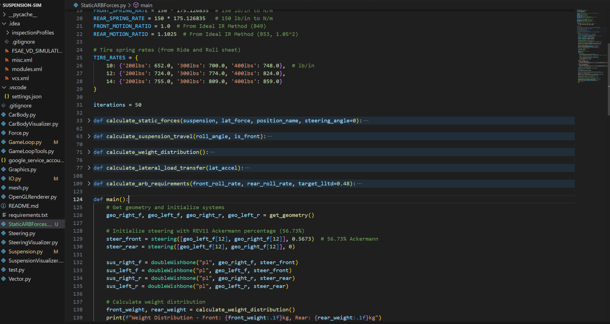
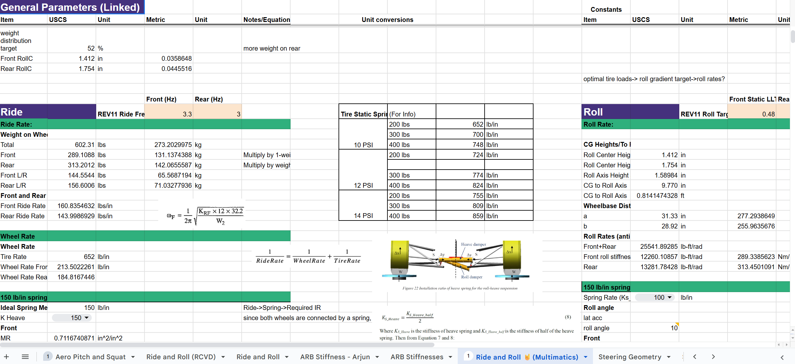
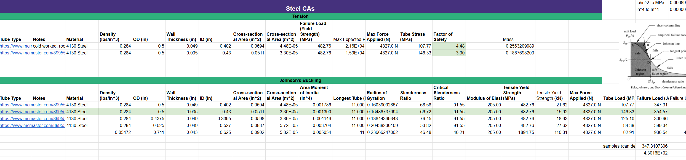

## Project Overview
I am leading a team of students in the designing, manufacturing, and testing of the suspension and steering systems for the 25-26 FSAE vehicle. Below are a few of the key technical components/projects I have completed so far.

I played a large role in research and project management before commencement of the 25-26 season. I conducted research into a decoupled suspension system and revamped our calculations for the change if need be.

As suspension lead, I designed the dynamic parametric Suspension and Steering CAD Assembly, optimized suspension geometry, and manufactured the systems.

### Front and Rear Suspension

### Iterative Parametric CAD

The dynamic CAD assembly facillitates high frequency geometry optimization and packaging integration iterations, allowing for the design of geometry through a point cloud system.

#### Rocker Design and Multi-Body FEA
I designed the new rockers for REV 11, reducing them in size and mass while still hitting our stiffness targets.

This was verified using multi-body FEA in Ansys Workbench, encompassing both in plane and off axis loading scenarios.

I designed the fixtures used for the new rockers, helping shorten manfuacturing time. The rockers were manufactured by other members on the team on the HAAS Mini-Mill CNC Mill.

### Anti Roll Bar Compliance Testing
I worked with one other team member to conduct the most comprehensive anti roll bar compliance tests in team history. Helping improve anti roll bar stiffness tuning and accuracy by more than 200%

### Lotus Kinematics

I used the Lotus kinematics software to design optimize our suspension setup acccording to in house vehicle dynamics simulations and tire graphs fitted using OptimumT.

#### Custom Dynamic Load Solver

I revamped the blade-style anti roll bar design process, implementing a new dynamic load solver in python that more automates more of the iterative process whilst improving accuracy.

### Revamped calculations and considerations for decoupled suspension

I created the suspension master sheet for sitffness calculations, hand calcs for sizing components, etc. 

#### Suspension Calculation Master Sheet

