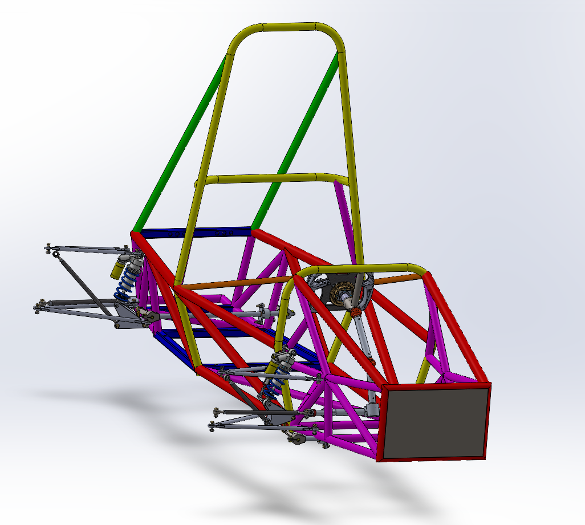

## Project Overview
I am leading a team of students in the designing, manufacturing, and testing of the suspension and steering systems for the 25-26 FSAE vehicle. Below are a few of the key technical components/projects I have completed so far.

I played a large role in research and project management before commencement of the 25-26 season. I conducted research into a decoupled suspension system and revamped our calculations for the change if need be.

### Revamped calculations and considerations for decoupled suspension

As suspension lead, I created the suspension master sheet for sitffness calculations, hand calcs for sizing components, etc. 

#### Suspension Calculation Master Sheet

I also designed the dynamic parametric Suspension and Steering CAD Assembly and optimized suspension geometry using the Lotus Kinematics Solver

### Iterative Parametric CAD

The dynamic CAD assembly facillitates high frequency geometry optimization and packaging integration iterations, allowing for the design of geometry through a point cloud system.

### Lotus Kinematics

I used the Lotus kinematics software to design optimize our suspension setup acccording to in house vehicle dynamics simulations and tire graphs fitted using OptimumT.

#### Custom Dynamic Load Solver

I revamped the blade-style anti roll bar design process, implementing a new dynamic load solver in python that more automates more of the iterative process whilst improving accuracy.

