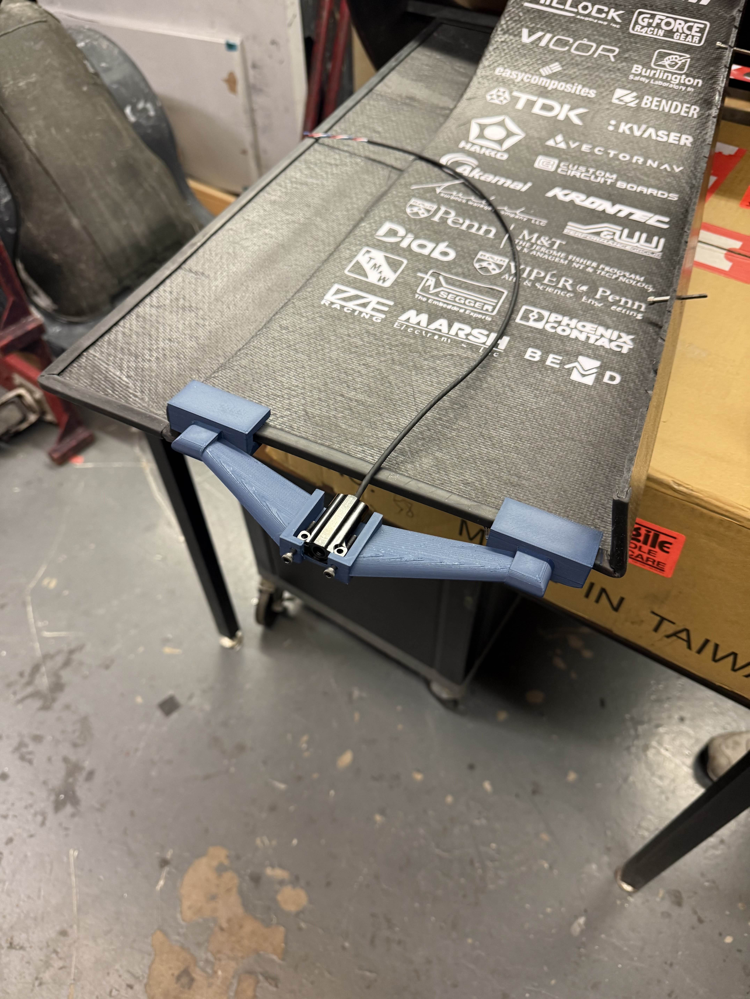

## Project Overview
An iteresting small task I was assinged to was the design of the external tire temperature sensor mount. This mount is designed to allow for easy attachement and removal from the vehicle, and also enables the sensor to capture the entire width of the tire in its FOV. This allowed us to use the data collected to better tune our static wheel camber.

A lofted airfoil was used on the mount to better redirect airflow for the side wings.

### 3D Printed Tire Temperature Sensor

